# EPI_JAM_2020_2
48h Epitech Jam 2nd edition. [THEME: STREET ART]

# Streetline Preview
### Main Menu
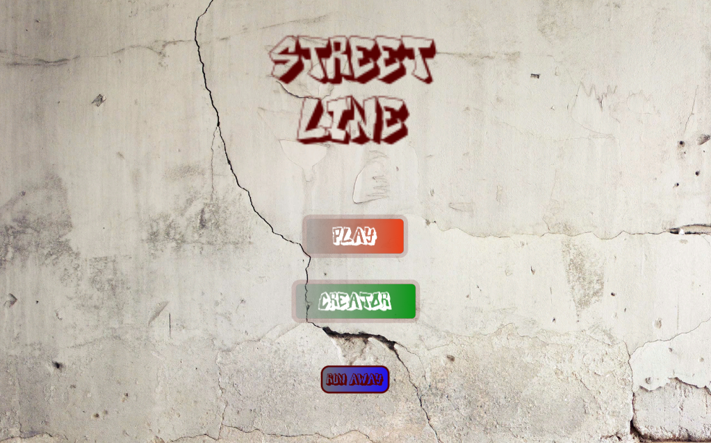

### Play Mode 
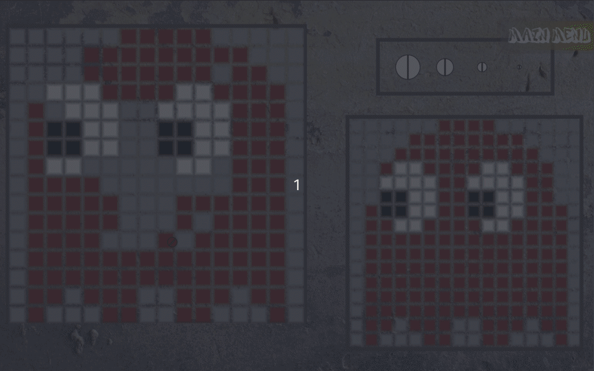

### Creator Mode 
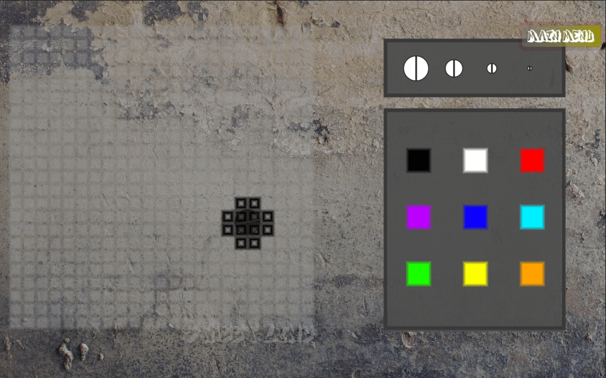

### StreetShots
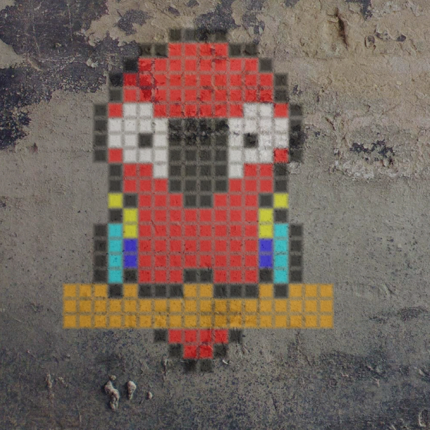

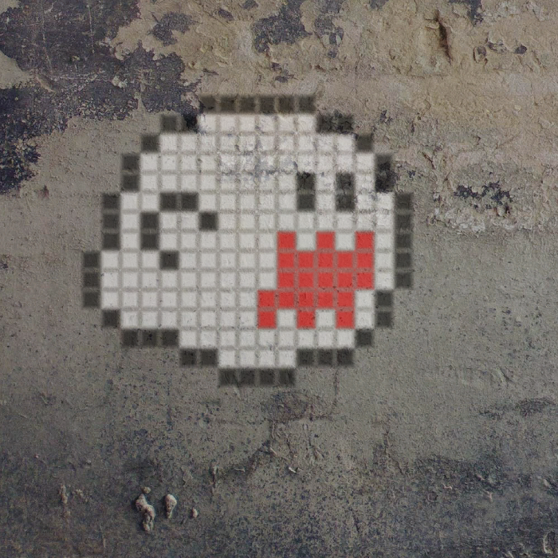

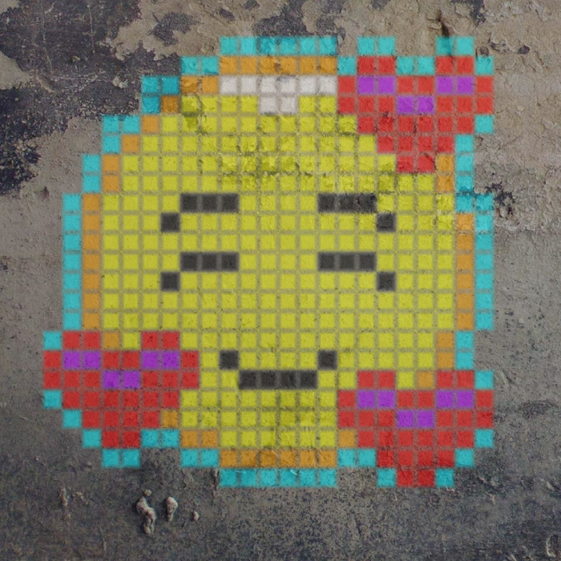

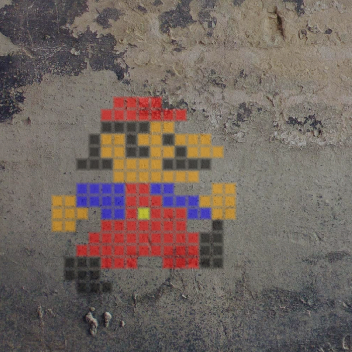

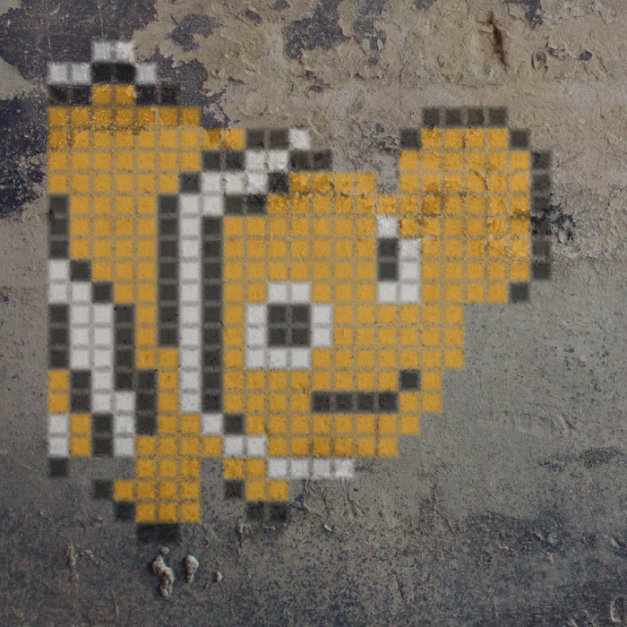

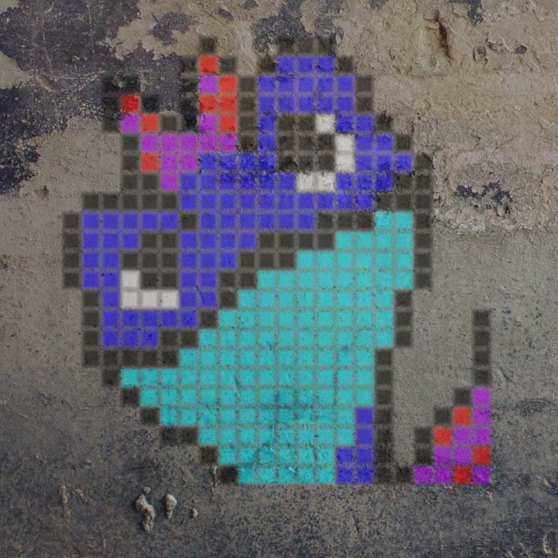

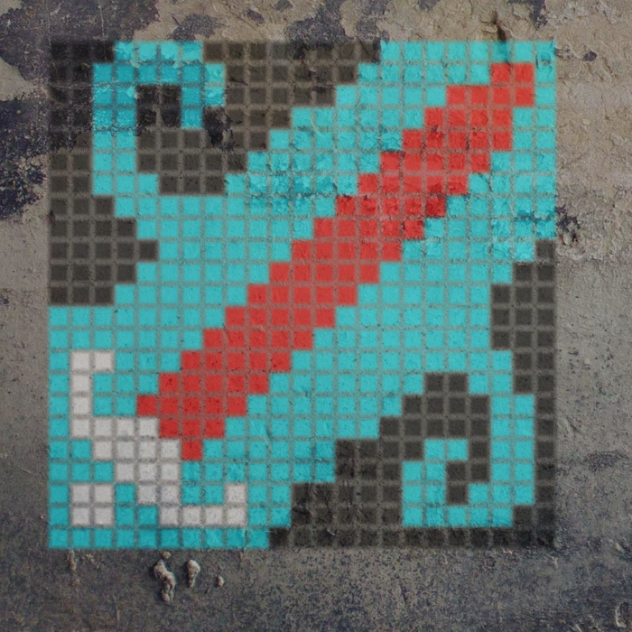

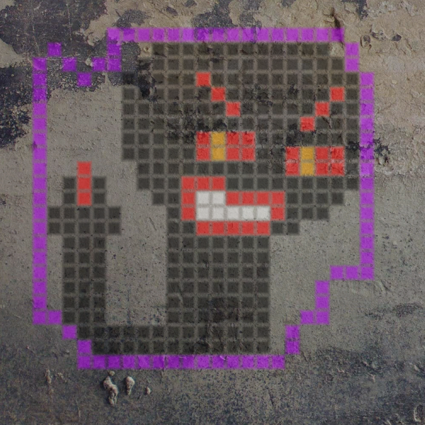

*HOW TO PLAY :*
# Linux
-   Open your terminal in the root directory (EPI_JAM_2020_2) and run `cd bin/Linux && ./StreetLineLNX.x86_64`
# Windows
-   Open folder 'EPI_JAM_2020_2/bin/Windows' and run 'StreetLine.exe'

*CONTROLS :*
# Keyboard Bindings (Play Mode)
-   Paint: 'Left Click'
-   Eraser : 'Right Click'
-   Reset : 'R'

# Keyboard Bindings (Creator Mode)
-   Paint: 'Left Click'
-   Eraser : 'Right Click'
-   Reset : 'R'
-   Show Grid : 'E'
-   Take Screenshot : 'Space' (Save location: 'StreetLine_Data/Streetshots')
